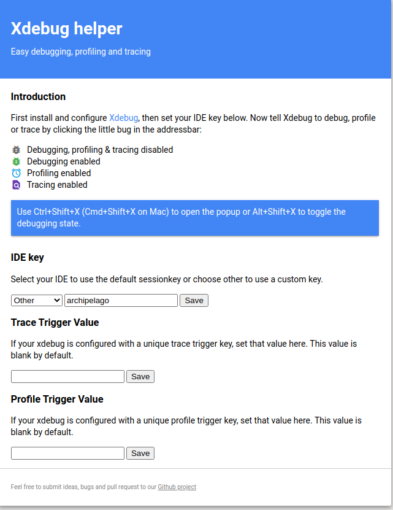

# Debugging PHP in Archipelago

This document describes how to enable Xdebug for local PHP development using the PHPStorm IDE and a docker container running the Archipelago `esmero-php:development` image. It involves interacting with the [esmero/archipelago-docker-images](https://github.com/esmero/archipelago-docker-images) repo and the [esmero/archipelago-deployment](https://github.com/esmero/archipelago-deployment) repo.

## Part 1: Docker
1. Run the following commands from your `/archipelago-deployment` directory:

   `docker-compose down` \
   `docker-compose -f docker-compose.yml -f docker-compose.dev.yml up -d`

   <br>This version of `docker-compose up` uses an override file to modify our services. `docker-compose.dev.yml` we now have an extra PHP container called `esmero-php-debug`. 

   <br>To stop the containers in the future, run `docker-compose -f docker-compose.yml -f docker-compose.dev.yml down`.

    <br>_(To make these commands easier to remember, consider making bash aliases in your .bashrc file.)_
    <br>_(If you are running your development on a Linux system, you may need to make a modification to your xdebug configuration file on the esmero-php-dev container. See appendix at the bottom of this page. )

    <br>So we have reloaded the containers and now you are ready for Part 2.

## Part 2: PHPStorm

1. In PHPStorm, open your `archipelago-deployment` project.

2. Go to `Preferences > Languages & Frameworks > PHP > Debug` or `Settings > PHP > Servers`. In this window there is an Xdebug section. Use these settings:
    - Debug port: `9003`. (do NOT use the default, 9000)
    - Can accept external connections: yes, select checkbox
    - (optional) Break at first line in PHP scripts: uncheck. If you leave this selected, you will have to manually step through a breakpoint from Drupal's main index.php file on every request, which is quite annoying. However, leaving this box checked can be useful for making sure the connection is working at first, before you have set any internal breakpoints.

    Your settings should look like this. Hit APPLY and OK.
        

3. Go to `Preferences > Languages & Frameworks > PHP > Servers`. We will create a new server here. Use these settings:
    - Name: `docker-debug-server`
    - Host: `localhost`
    - Port: `8001`
    - Use path mappings: yes, select the checkbox
    - Under project files, select the top-level `archipelago-deployment` directory in the `File/Directory` column.
    - In the `Absolute path on the server` add `/var/www/html`

    Hit APPLY and OK and close the window.

        

 4. Go to `Run > Edit Configurations`. Hit the `+` Button to create a new PHP Remote Debug. Name whatever you want, I called mine `docker`. Use these settings:
    - Filter debug connection by IDE Key: yes, select the checkbox
    - Server: select `docker-debug-server` from dropdown (we created this in step 3)
    - IDE Key: `archipelago` (this matches the key set in our container)

        

 5. Note: If you try to validate your connection, it will fail. But that's ok.

 # Set up Browser Integration

 1. We have had success using the [XDebug Helper](https://chrome.google.com/webstore/detail/xdebug-helper/eadndfjplgieldjbigjakmdgkmoaaaoc?hl=en) extension in Chrome. Once you have the extension installed, right-click on the bug icon in the top right of your chrome browser window and select "Options" to configure the IDE key. Under "IDE", select "Other", and in the text box, enter "archipelago"

    
    
 
 # Actually Debugging!
 1. Hit the button (top right bar of PHPStorm) that looks like a telephone, for `Start Listening for PHP Debug Connections`.

      

 2. Now, you can use `Run > Debug` and select the `Archipelago` named configuration that we created in the previous steps. The debugging console will appear. It will say it is waiting for incoming connection from 'archipelago'
 .
    
    

 3. Right now the debugging session is not enabled. Browse to  `localhost:8001`. Click on the gray XDebug Helper icon at the top right of your window and select the green "Debug" button. This will tell chrome to set the xdebug session key when you reload the page.

  4. Now set a breakpoint in your code, and refresh the page.
 If you have breakpoints set, either manually, or from leaving "Break at first line in PHP scripts" checked, you should have output now in the debugger.

 5. If you are done actively debugging, it is best to click the green XDebug Helper icon and select "Disable". This will greatly improve speed and performance for your app in development. When you need to debug, just turn on debugging using the XDebug Helper button again.

 6. If you would like to see the output of your xdebug logs, run the following script:
 `docker exec -ti esmero-php bash -c 'tail -f /tmp/xdebug.log > /proc/1/fd/2'`

    Then, you can use the typical docker logs command on the `esmero-php` container, and you will see the xdebug output:
    `docker logs esmero-php -f`


Xdebug makes accessing variables in Drupal kind of great. Many possibilities, including debugging for Twig templates. Happy debugging!

---

Thank you for reading! Please contact us on our [Archipelago Commons Google Group](https://groups.google.com/forum/#!forum/archipelago-commons) with any questions or feedback.

Return to the [Archipelago Documentation main page](../README.md).

---
### Appendix: XDebug on a linux host

If you are developing on a linux machine, you may need to make a change to the xdebug configuration file.
1. Create a new file in the `/archipelago-deployment/xdebug` folder called `xdebug.ini` and enter the following text:
    ```
    zend_extension=xdebug
    
    [xdebug]
    xdebug.mode=develop,debug
    xdebug.discover_client_host = 1
    xdebug.start_with_request=yes
    ```
3. Make a bind mount to this file in your docker-compose-dev.yml file:
    ```yml
      php-debug:
      ...
        volumes:
      - ${PWD}:/var/www/html:cached
        # Bind mount custom xdebug configuration file...
      - ${PWD}/xdebug/xdebug.ini:/usr/local/etc/php/conf.d/docker-php-ext-xdebug.ini
    ```
4. Restart your docker containers using the method described at the top of this page.