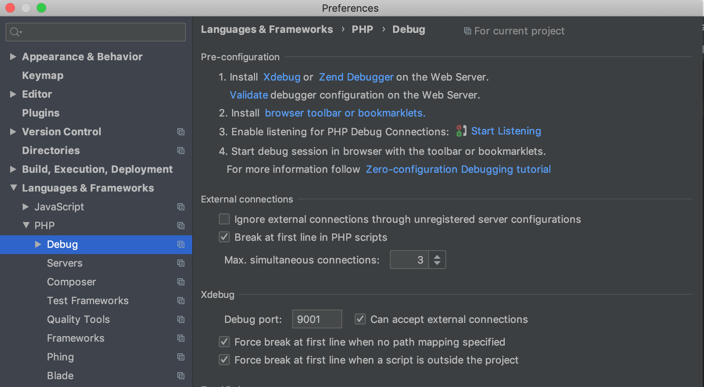

# Debugging PHP in Archipelago

This document describes how to enable Xdebug for local PHP development using the PHPStorm IDE and a docker container running the Archipelago `esmero-php:development` image. It involves interacting with the [esmero/archipelago-docker-images](https://github.com/esmero/archipelago-docker-images) repo and the [esmero/archipelago-deployment](https://github.com/esmero/archipelago-deployment) repo.

## Part 1: Docker
1. Find out what your local machine (your actual computer!) IP address is. For example mine is, `192.168.1.3`

1. Build the development image with Xdebug enabled. Run the following from the `/archipelago-docker-images/esmero-php-fmp` folder.
`sudo docker build -f Dockerfile.dev --build-arg LOCAL_IP=<your machine IP> -t esmero-php:development . --no-cache`

2. Run the following commands from your `/archipelago-deployment` directory:
   
   `docker-compose down` \
   `docker-compose -f docker-compose.yml -f docker-compose.dev.yml up -d`
   
   This version of `docker-compose up` uses an override file and to specify we want to use the development image for our PHP service. It will rebuild the containers and now you are ready for Part 2.

## Part 2: PHPStorm

1. In PHPStorm, open your `archipelago-deployment` project.
 
2. Go to `Preferences > Languages & Frameworks > PHP > Debug`. In this window there is an Xdebug section. Use these settings:
    - Debug port: `9999`. (do NOT use the default, 9000)
    - Can accept external connections: yes, select checkbox
    
    Your settings should look like this (img). Hit APPLY and OK.
    

3. Go to `Preferences > Languages & Frameworks > PHP > Servers`. We will create a new server here. Use these settings:
    - Name: `docker-debug-server`
    - Host: `localhost`
    - Port: `8001`
    - Use path mappings: yes, select the checkbox
    - Under project files, select the top-level `archipelago-deployment` directory in the `File/Directory` column.
    - In the `Absolute path on the server` add `/var/www/html`
    
    Hit APPLY and OK and close the window. (img)
        

 
 4. Go to `Run > Edit Configurations`. Hit the `+` Button to create a new PHP Remote Debug. Name whatever you want, I called mine `archipelago`. Use these settings:
    - Filter debug connection by IDE Key: yes, select the checkbox
    - Server: select `docker-debug-server` from dropdown (we created this in step 3)
    - IDE Key: `archipelago` (this matches the key set in our container)
        

 
 5. Validate your connection. With  `Run > Edit Configurations` still open, you can hit the link that says "Validate". Use these settings in the following validation window:
    - Path to create validation script `<your local path>/archipelago-deployment/web`
    - Url to validation script: `http://localhost:8001`
    
    Hit VALIDATE. You should get a series of green check marks. If you get a warning about missing `php.ini` file, that is OK, our file has a different name in the container (`xdebug.ini`) and is still being read correctly.
        

 
 # Actually Debugging!
 1. One last thing. Hit the button (top right bar of PHPStorm) that looks like a telephone, for `Start Listening for PHP Debug Connections`.
 
       
 2. Now, you can use `Run > Debug` and select the `docker-debug-server` that we created in the previous steps. The debugging console will appear. Happy debugging!
 
 ####Questions? Please ask our [Google Group](https://groups.google.com/forum/#!forum/archipelago-commons)
 
 
 
 
 

